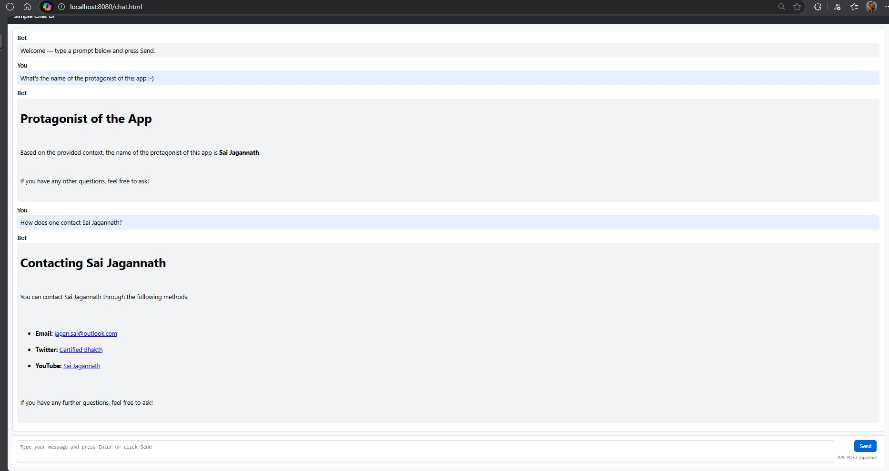

# 02-rag-loader — README

## 1. Goal of this module

This module is a small Spring Boot demo that shows how to: accept user prompts via an HTTP API, ask an LLM (via Spring AI ChatClient) for a Markdown response, convert that Markdown to HTML, and store / search small documents in a local in-memory vector store for retrieval-augmented responses.

The implementation is intentionally simple and targeted for local development and experimentation.

## 2. What APIs are used

- Spring Boot (web starter) — application framework and HTTP endpoints.
- Spring AI ChatClient — sends prompts to the configured LLM and applies advisors.
  - The controller constructs a ChatClient via the provided `ChatClient.Builder` with these default advisors:
    - `MessageChatMemoryAdvisor` (stores conversation memory)
    - `QuestionAnswerAdvisor` (wired to the app's `VectorStore`) 
    - `SimpleLoggerAdvisor`
- Spring AI `EmbeddingModel` — used to compute embeddings for documents and queries.
- `VectorStore` (Spring AI abstraction) — the code provides an in-memory implementation instead of Redis.
- Flexmark (flexmark-all) — converts Markdown produced by the LLM into HTML.
- Jackson (via Spring Boot) — JSON serialization for API requests/responses.

## 3. Implementation details of `InMemoryVectorStore`

Location: `src/main/java/com/example/ragloader/InMemoryVectorStore.java`

Key points:

- Purpose: a development/test fallback vector store that keeps documents and their embeddings in-memory.

- Data structures:
  - `List<Document> storage` — stores the Document objects (synchronized list for simple thread-safety).
  - `List<float[]> embeddings` — parallel list holding each document's embedding vector (same index as `storage`).

- Construction and dependencies:
  - `EmbeddingModel` is constructor-injected. The store uses it to compute embeddings for Documents and query strings.

- add(List<Document>):
  - For each Document, attempts to compute an embedding:
    - First tries `embeddingModel.embed(Document)`.
    - If that fails and the Document has text, falls back to `embeddingModel.embed(String)`.
  - If an embedding is computed, the Document and its embedding are appended to their respective lists.
  - Errors while embedding a document are logged and that document is skipped.

- similaritySearch(SearchRequest):
  - Embeds the incoming query string using `EmbeddingModel`.
  - Computes cosine similarity between the query embedding and each stored embedding.
  - Applies `SearchRequest.getSimilarityThreshold()` and `getTopK()` to filter and rank results.
  - Returns a list of matching `Document` objects sorted by similarity.

- delete(List<String> ids) and delete(Filter.Expression):
  - `delete(List<String>)` removes documents (and their embeddings) whose `Document.getId()` matches any id in the list.
  - `delete(Expression)` is a no-op (logged) in this simple implementation.

- snapshot():
  - Returns a shallow copy of the stored `Document` list for debugging/tests.

- Thread-safety and limitations:
  - The implementation uses `Collections.synchronizedList(...)` for simple concurrency protection. This is not optimized for high-throughput or large datasets.
  - All embeddings are kept in memory; not suitable for production or large corpora.
  - Similarity is computed with a straightforward O(N) cosine similarity scan.

- Logging:
  - The class logs embedding failures and counts of stored documents.

## 4. API(s) exposed by this module

- POST `/api/chat` — accepts JSON and returns the LLM response in both Markdown and HTML.

  Request JSON (example):
  ```json
  { "prompt": "Explain recursion in simple terms." }
  ```

  Response JSON (example):
  ```json
  { "markdown": "# Recursion\n...", "html": "<h1>Recursion</h1>..." }
  ```

  Notes:
  - The controller instructs the model to respond using Markdown. The server converts the Markdown to HTML using flexmark and returns both forms.
  - The ChatClient used by the controller includes the vector-store based advisor (`QuestionAnswerAdvisor`) so RAG-style behavior (if documents are loaded) will be applied.

## How to build and run (current implementation)

From the repository root (PowerShell):

```powershell
# Build the module
mvn -DskipTests package -pl 02-rag-loader -am

# Start the module (there is a helper start script in the module)
cd 02-rag-loader
.\start.ps1
```

The web UI is available at `http://localhost:8080` and the simple client at `/chat.html` will POST to `/api/chat`.

## Screenshot

Screenshot (for quick reference):



(absolute path in repo: `02-rag-loader/src/main/resources/images/SS.jpg`)

---

Notes and caveats
- This README documents the current (in-memory) implementation only. For production use you should replace the in-memory store with a persistent/managed vector database (Redis, Pinecone, Milvus, etc.), add sanitization for HTML rendering in the client, and add batching/optimizations for embedding generation.

If you want, I can:
- Add a Maven profile to switch between in-memory and Redis-backed VectorStore.
- Add unit tests for `InMemoryVectorStore` (happy path + edge cases).
- Add client-side sanitization (DOMPurify) to the `chat.html`.

Tell me which of those you'd like next.
